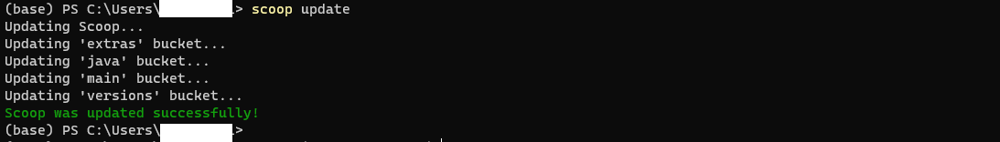
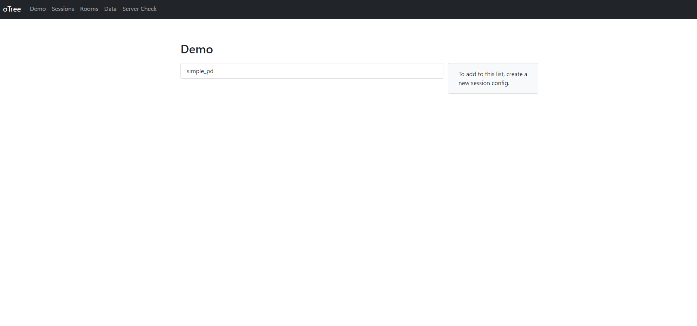

# 【Windows 編】初心者が oTree を自分のPCで動かせるようになるまで

## 1. 事前準備

### 1-1. oTree とは？
一言でいうと，[oTree](https://www.otree.org/) は，オンライン実験を手軽にできるようにした，とっても便利な Python ライブラリ（便利な機能集）です．

### 1-2. 必要なツールと環境
今回の記事では，以下のツールを使います．

1. **Python**  
   - oTree を動かすために必要なプログラミング言語です．
2. **PowerShell**  
    - 黒い画面のコマンドプロンプト（プログラマーがよく使うかっこいいやつ）です．
3. **scoop**  
   - Windows 用のパッケージマネージャー（AppStore みたいなやつ）です．  
4. **uv**  
   - 誰でも正確，かつ簡単に　oTree を動かすために必要なやつです．

---

## 2. scoop のインストール

### 2-1. scoop とは？
[scoop](https://scoop.sh/) は，Windows のプログラマー向け App store みたいなやつ（macOS で言う `Homebrew` ）です．

### 2-2. scoop のインストール方法
1. PowerShell を起動します（Windows キーを押して，power と入力し，Enter キーを押す）．  
2. 以下のコマンドをコピペして実行します．

```powershell
Set-ExecutionPolicy -ExecutionPolicy RemoteSigned -Scope CurrentUser
Invoke-RestMethod -Uri https://get.scoop.sh | Invoke-Expression
scoop install git pipx uv vscode-insiders
scoop bucket add extras
scoop update

```

詳しい手順は[【scoop】絶対にエラーなく最速で R と Rstudio を Windows にインストールする方法 #環境構築 - Qiita](https://qiita.com/ryu-takahashi2718/items/04702ac364821fc0e92d) を参照してください．

### 2-3. インストールされているかの確認

以下のような画面になって，`Scoop was updated successfully!` と表示されればインストール成功です．



---

## 3. uv のインストール

### 3-1. uv とは？
この記事では，oTree の開発環境の準備を簡単にするために， `uv` という便利なツールを使います．こちらもまた， AppStore みたいなやつです．

### 3-2. インストール方法

実は，先ほどのコマンドですでにインストール済み．

### 3-3. インストールされているかの確認
以下のコマンドでバージョン情報が表示されればインストール成功です．

```powershell
uv --version
```

---

## 4. oTree のインストール

oTree の説明はさっきしたので，早速インストールしていきましょう．

### 4-1. インストール方法

1. 以下のコマンドを Power Shell にコピペする

```powershell
pipx install -U otree==5.11.1

```

（pipx を scoop で先にインストールすることで，pip のインストールを個別でやらなくてもいいようにしました．）

### 4-3. インストールされているかの確認
```powershell
otree --version
```

を実行すると，バージョン情報やインストール先が表示されます．これで oTree の導入は完了です．

---

## 5. oTree プロジェクトの準備

### 5-1. テンプレートを使う理由
oTree は `startproject` コマンドなどでプロジェクトを初期化することもできますが，今回用意した[テンプレート](https://github.com/ryu-thakahashi/otree-template)を使えば，あらかじめ設定済みの構成でスムーズに始められます．

### 5-2. テンプレートをインストール

1. PowerShell 上で，書き換えても困らないフォルダに移動します．例：
   ```powershell
   cd C:\Users\[PowerShell に表示されている名前]\Documents
   ```
2. テンプレートをダウンロードします．以下のコマンドを実行します．
   ```powershell
   git clone https://github.com/ryu-thakahashi/otree-template.git
   ```
3. フォルダに移動します．
   ```powershell
   cd otree-template
   ```
4. 環境を同期させます．
   ```powershell
   uv sync
   ```


### 5-3. インストールされているかの確認
テンプレート内には `settings.py` や `simple_pd` ディレクトリなどが色々入っています．フォルダ構成が以下のようになっていれば OK です（一例）．
```
otree-template/
  ├─ __init__.py
  ├─ settings.py
  ├─ simple_pd/
  │   ├─ __init__.py
  │   ├─ models.py
  │   ├─ pages.py
  │   ├─ tests.py
  ...
  └─ ...
```

これで，oTree のプロジェクトの準備が整いました！

---

## 6. oTree の起動と動作確認

### 6-1. ローカルサーバーを起動する
1. 先ほどの `otree-template` フォルダ内にいることを確認してください．例：
   ```powershell
   C:\Users\[PowerShell に表示されている名前]\Documents\otree-template> 
   ```
   
2. oTree のローカルサーバーを起動します:
   ```powershell
   otree devserver
   ```
   しばらく待つと，PowerShell 上に `Starting server at http://0.0.0.0:8000/` のようなメッセージが表示されるはずです．

### 6-2. ブラウザで確認する
1. お使いのブラウザ（Chrome や Edge など）で，次の URL にアクセスします:
   ```
   http://localhost:8000/
   ```
2. oTree の初期画面（下の画像）が表示されれば，インストール成功です！




---

## 7. よくあるトラブルと対処法

### 7-1. scoop のインストールに失敗する
- **症状**: 「スクリプトがブロックされました」とエラーが出る  
  **対処**: PowerShell を管理者モードで開き，`Set-ExecutionPolicy RemoteSigned -Scope CurrentUser` を実行してください．その後，通常モードの PowerShell で再度試してください．

### 7-2. uv のコマンドが見つからない
- **症状**: `uv : 用語 'uv' は認識されません．` などと表示される  
  **対処**: 
  1. scoop が正しくインストールされているか確認 (`scoop --version`)  
  2. 再度 `scoop install uv` を実行  
  3. PowerShell を再起動してパスが通っているか確認

### 7-3. oTree の起動でエラーが出る
- **症状**: `ModuleNotFoundError` や `django.core.exceptions.ImproperlyConfigured` などが表示される  
  **対処**: 
  1. 仮想環境がアクティブになっているか確認 (`uv activate myenv`)  
  2. `pip install otree` の打ち忘れやタイポがないか確認  
  3. テンプレートプロジェクトのディレクトリに移動しているか確認

### 7-4. ポートが使用中でサーバーが立ち上がらない
- **症状**: `Address already in use` というエラー  
  **対処**: 既に 8000 番ポートが別のプロセスで使われている可能性があります．ほかのアプリケーションを終了させるか，別のポートで起動する（例：`otree devserver --port=8001`）などの対処を行いましょう．

---

# まとめ

以上が，Windows 環境で初心者が oTree を動かせるようになるまでの基本的な流れです．

1. **scoop** を使ってサクッと環境構築を簡単にする  
2. **uv** で仮想環境を手軽に扱う  
3. **oTree** をインストールし，テンプレートからスタートプロジェクトを作成  
4. ローカルでサーバーを起動して実験タスクを確認  

この記事の手順どおり進めれば，最小限のコマンドで oTree を体験できるはずです．もし途中でエラーやつまずきがあっても，上記のトラブルシューティングや公式ドキュメントを参考にしつつチャレンジしてみてください．  

これで Windows でも oTree の開発・動作確認ができるようになります．お疲れさまでした！